# 70. Reactプロジェクトの作成
npx create-react-app web-knock-7  
cd web-knock-7  
npm start  

→デフォルトの画面がlocalhost:3000に表示される  

# 71. 最初のコンポーネントの作成
profile.js  
  
App.js  
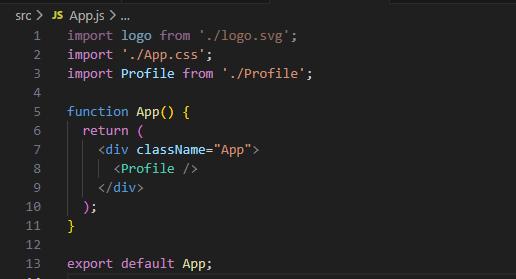  
結果   
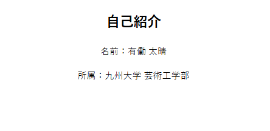  

# 72. propsを用いたデータ受け渡し
profile.js  
引数にpropsを追加  
親コンポーネント(App.js)から受け取る  
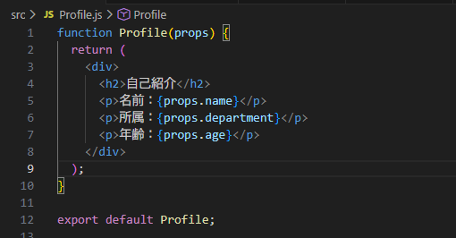  
App.js  
子コンポーネント(Profile.js)にデータを渡す  
数値は{}で囲む  
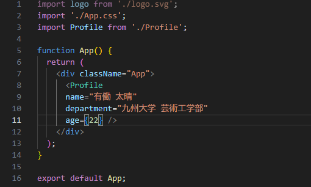  
結果  
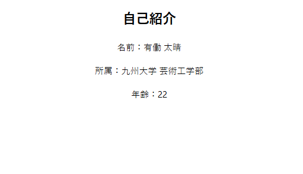  

# 73. useStateによる状態管理
counter.js    
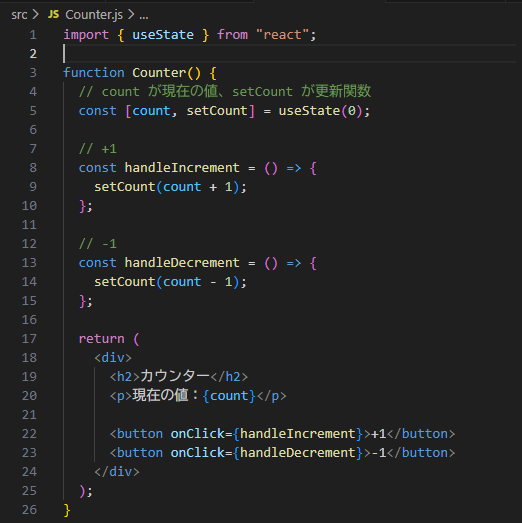
結果  
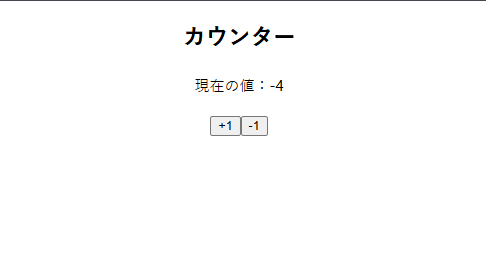

# 74. リストの動的描画
FruitList.js  
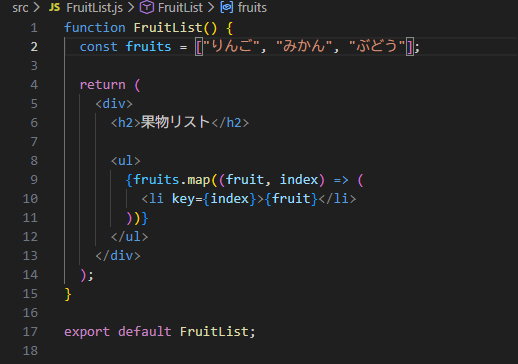  
ToDoList.js  
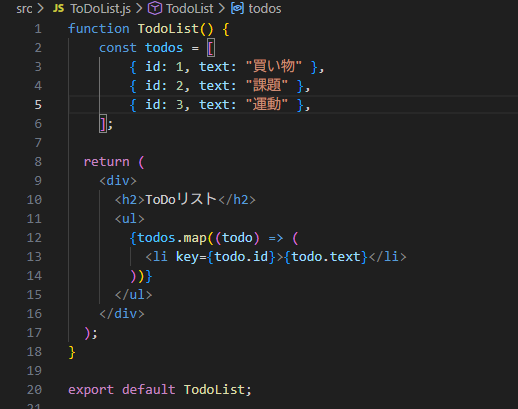  
結果  
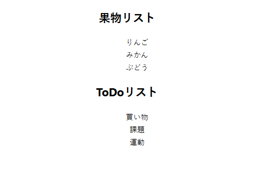  

# 75. フォーム入力とイベント処理
[ToDoList.js](src/ToDoList.js)  
結果  
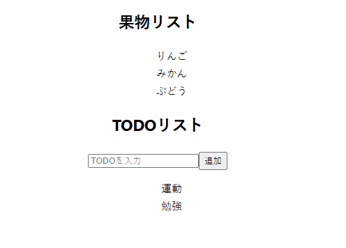  

# 76. useEffectによる副作用処理
[Console.js](src/Console.js)  
結果  
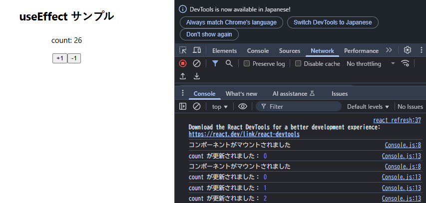  

# 77. 複数コンポーネントの分割・再利用
[Header.js](src/components/Header.js)  
[Main.js](src/components/Main.js)  
[Footer.js](src/components/Footer.js)  
これらをApp.jsで組み合わせる  
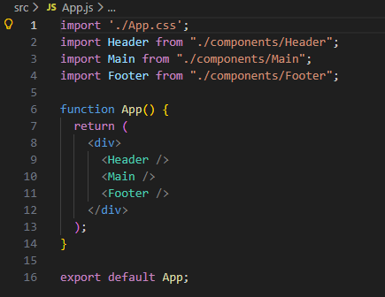  
結果  

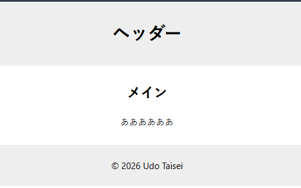  

# 78. react-router-domを利用したルーティング
npm install react-router-dom  
[Header.js](src/components/Header.js)  
[About.js](src/components/About.js)  
[Home.js](src/components/Home.js)  
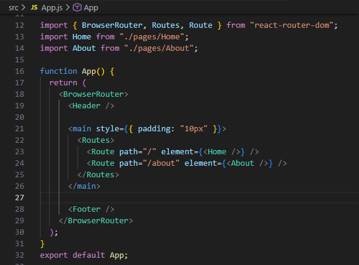  
結果  
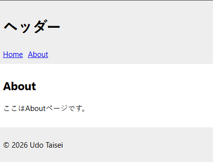  